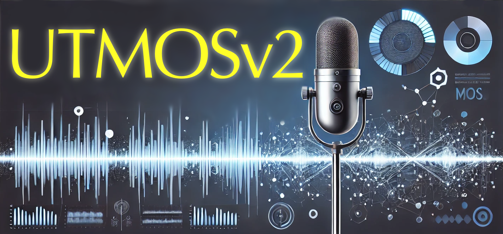

<p align="center">
  
</p>

<h1 align="center">
  UTMOSv2: UTokyo-SaruLab MOS Prediction System
  <a href="https://github.com/sarulab-speech/UTMOSv2">
    
  </a>
</h1>

<p align="center">
  ✨&emsp;&emsp;UTMOSv2 achieved 1st place in 7 out of 16 metrics&emsp;&emsp;✨<br>
  ✨🏆&emsp;&emsp;&emsp;&emsp;and 2nd place in the remaining 9 metrics&emsp;&emsp;&emsp;&emsp;🏆✨<br>
  ✨&emsp;&emsp;&emsp;&emsp;in the <a href="https://sites.google.com/view/voicemos-challenge/past-challenges/voicemos-challenge-2024">VoiceMOS Challenge 2024</a> Track1!&emsp;&emsp;&emsp;&emsp;✨
</p>

<div align="center">
  <a target="_blank" href="https://www.python.org">
    
  </a>
</div>

<div  align="center">
  <a target="_blank" href="https://huggingface.co/spaces/sarulab-speech/UTMOSv2">
    
  </a>
  <a target="_blank" href="https://colab.research.google.com/github/sarulab-speech/UTMOSv2/blob/main/quickstart.ipynb">
    
  </a>
</div>

<br>

<h2 align="left">
  <div>🚀 Quick Prediction</div>
  <a href="https://github.com/sarulab-speech/UTMOSv2/tree/main?tab=readme-ov-file#---quick-prediction--------">
    
  </a>
</h2>

✨ You can easily use the pretrained UTMOSv2 model!

> [!NOTE]
> To clone the repository and use the pretrained UTMOSv2 model, make sure you have `git lfs` installed. If it is not installed, you can follow the instructions at [https://git-lfs.github.com/](https://git-lfs.github.com/) to install it.

1. Clone this repository and navigate to UTMOSv2 folder

   ```bash
   git clone https://github.com/sarulab-speech/UTMOSv2.git
   cd UTMOSv2
   ```

2. Install Package

   ```bash
   pip install --upgrade pip  # enable PEP 660 support
   pip install -e .
   ```

3. Make predictions
   - To predict the MOS of a single wav file:

      ```bash
      python inference.py --input_path /path/to/wav/file.wav --out_path /path/to/output/file.csv
      ```

   - To predict the MOS of all `.wav` files in a folder:

      ```bash
      python inference.py --input_dir /path/to/wav/dir/ --out_path /path/to/output/file.csv
      ```

> [!TIP]
> If `--out_path` is not specified, the prediction results will be output to the standard output. This is particularly useful when the number of files to be predicted is small.

> [!NOTE]
> Either `--input_dir` or `--input_path` must be specified, but not both.

> [!NOTE]
> This is a method for making quick and simple predictions. For more accurate predictions and detailed usage of the inference script, please refer to the [inference guide](docs/inference.md).

🤗 You can try a simple demonstration on Hugging Face Space:
<a href="https://huggingface.co/spaces/sarulab-speech/UTMOSv2">
  
</a>

<h2 align="left">
  <div>⚒️ Train UTMOSv2 Yourself</div>
  <a href="https://github.com/sarulab-speech/UTMOSv2/tree/main?tab=readme-ov-file#--%EF%B8%8F-train-utmosv2-yourself--------">
    
  </a>
</h2>

If you want to train UTMOSv2 yourself, please refer to the [training guide](docs/training.md). To reproduce the training as described in the paper or used in the competition, please refer to [this document](docs/reproduction.md).

<h2 align="left">
  <div>📂 Used Datasets</div>
  <a href="https://github.com/sarulab-speech/UTMOSv2/tree/main?tab=readme-ov-file#---used-datasets--------">
    
  </a>
</h2>

Details of the datasets used in this project can be found in the [datasets documentation](docs/datasets.md).